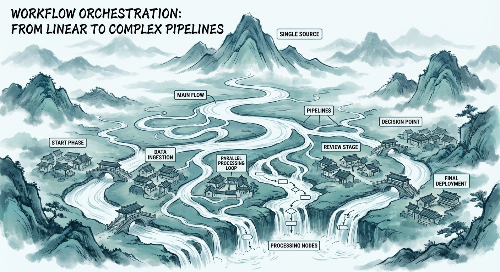
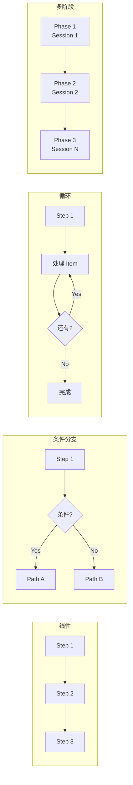
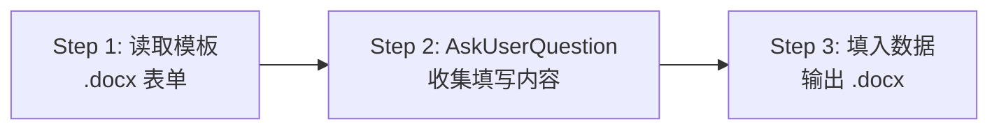
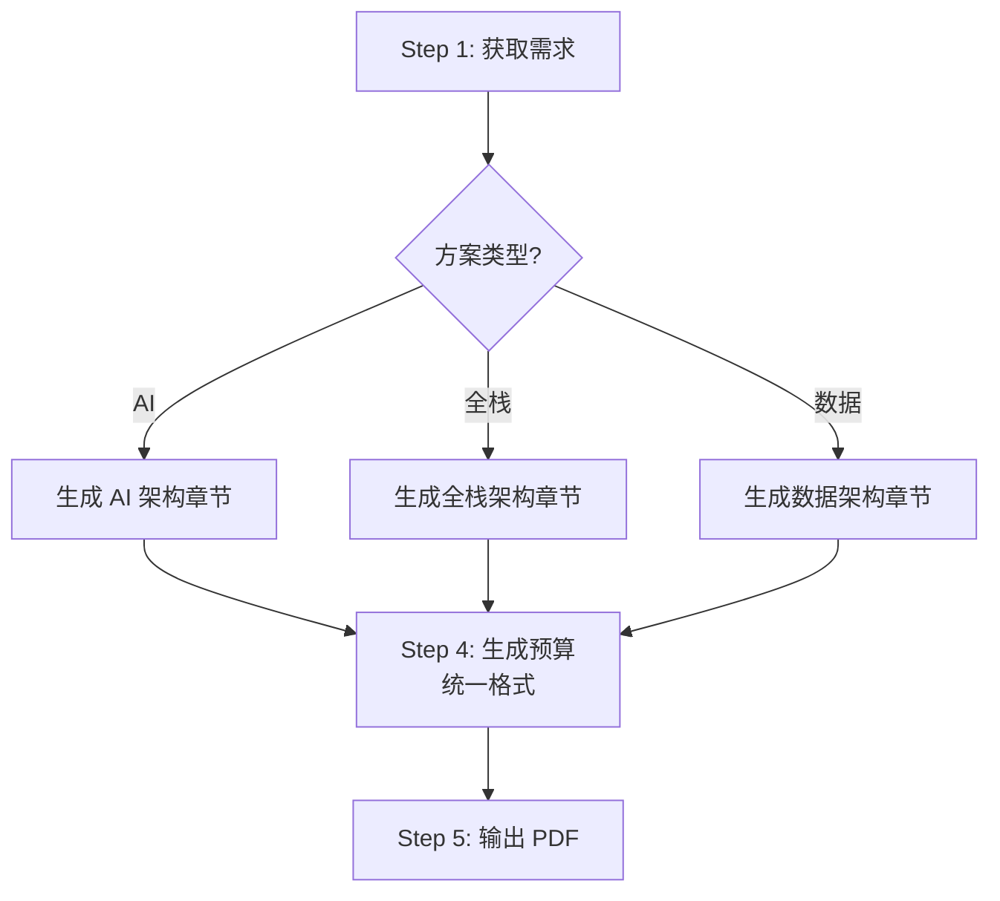
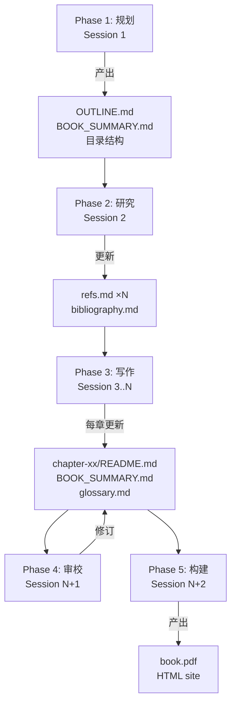
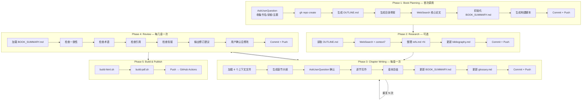
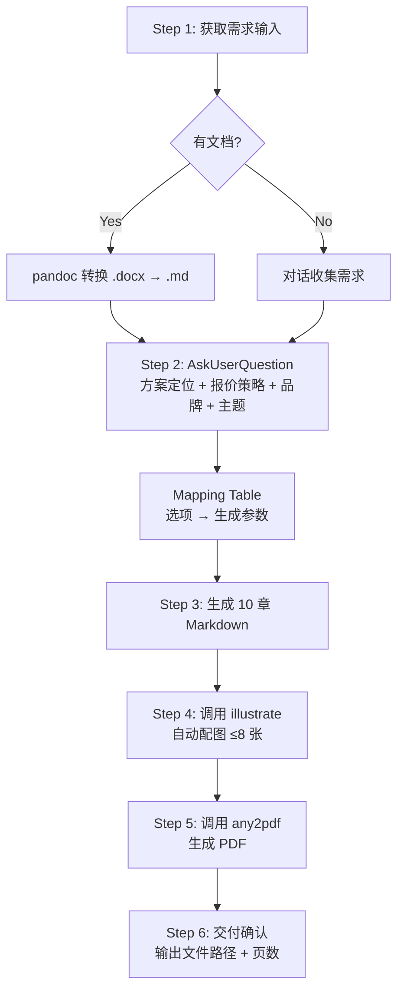

# 第 6 章：Workflow 编排 — 从线性流程到复杂管线




> *"好的 Skill 给 AI 一条清晰的路；伟大的 Skill 给 AI 一张地图。"*

前一章我们讨论了 Instruction 设计的艺术 —— 如何用精确的指令让 AI 理解单个步骤。但真实世界的任务很少只有一步。生成一份商务方案需要经历「需求采集 → 分析 → 生成 → 配图 → 排版 → 交付」六个阶段；写一本技术书籍更是跨越数周、数十次会话的超长流程。这些多步骤任务的编排，就是 Workflow 设计的核心课题。

本章将从最简单的线性流程出发，逐步引入条件分支、循环批处理和多阶段跨会话等模式，最后通过两个真实案例 —— `lovstudio:tech-book` 和 `lovstudio:proposal` —— 深入剖析 Workflow 编排的设计决策。

---

## 6.1 为什么需要 Workflow 编排

回顾第 2 章的 Skill 架构，SKILL.md 的 body 部分本质上是一段 Instruction 文档。AI 助手加载这段文档后，按照其中的指令执行任务。问题在于：**如果没有显式的流程编排，AI 会倾向于一股脑把所有事情做完** —— 跳过用户确认、遗漏关键步骤、或者在错误的时机执行某些操作。

Workflow 编排解决三个核心问题：

1. **执行顺序**：哪些步骤必须先后执行，哪些可以并行
2. **决策点**：在哪里需要用户输入来决定后续路径
3. **上下文管理**：每个步骤需要哪些输入，产出哪些中间制品

让我们用一个 Mermaid 图展示 Workflow 复杂度的四个层次：



从 L1 到 L4，Workflow 的设计复杂度递增，但核心思路不变：**用结构化的指令为 AI 画出一条（或多条）清晰的执行路径**。

---

## 6.2 线性 Workflow：最简单也最常用

线性 Workflow 是最基础的模式：Step 1 → Step 2 → Step 3，每一步的输出作为下一步的输入。大多数 Skill 的 Workflow 都是线性的，或者以线性为主干。

### 设计模式

```markdown
## Workflow (MANDATORY)

### Step 1: 获取输入
使用 AskUserQuestion 收集参数...

### Step 2: 处理
执行核心逻辑...

### Step 3: 输出
生成最终产物...
```

### 关键设计原则

**原则一：每步有明确的输入/输出契约。** 不要让 AI 猜测上一步产出了什么。好的写法：

```markdown
### Step 2: 生成 Markdown
基于 Step 1 收集的参数，生成 Markdown 文档。
输出文件：`{project-name}-{date}-v0.1.md`
```

坏的写法：

```markdown
### Step 2: 生成文档
根据之前的信息生成文档。
```

"之前的信息" 含糊不清 —— AI 可能回溯整个对话历史去猜测你想要什么，也可能只看最后一条消息。

**原则二：用 MANDATORY 标记不可跳过的步骤。** AI 有时会"聪明"地跳过它认为不必要的步骤。如果某步骤必须执行（比如用户确认），显式标注：

```markdown
### Step 2: 确认选项 (MANDATORY — DO NOT SKIP)
使用 AskUserQuestion 展示选项并等待用户确认。
未经用户确认，不得进入 Step 3。
```

**原则三：步骤编号要连续且可追踪。** 使用 `Step 1 / Step 2 / Step 3` 或 `Phase 1 / Phase 2` 这样的编号，方便在调试时定位 AI 执行到了哪一步。避免用纯文字标题（如"获取输入"、"处理"、"输出"）代替编号 —— 当 AI 报告进度时，"正在执行 Step 3" 比"正在处理"清晰得多。

### 实际案例：lovstudio:fill-form

`fill-form` 是一个典型的三步线性 Workflow：



每一步的边界清晰：Step 1 产出模板结构（字段列表），Step 2 产出用户数据（字段 → 值映射），Step 3 消费两者生成最终文件。这就是线性 Workflow 的理想形态 —— 简单、可预测、易调试。

---

## 6.3 条件分支：根据用户输入走不同路径

真实场景中，一条直线往往不够用。用户的输入会导致不同的执行路径 —— 选择了 "AI 智能化方案" 和选择了 "全栈开发方案" 意味着完全不同的后续生成逻辑。

### 设计模式

条件分支通常出现在 `AskUserQuestion` 之后。设计关键是**把选项到执行路径的映射关系写清楚**：

```markdown
### Step 2: 确认方案类型

使用 AskUserQuestion 收集方案定位：
 a) AI 智能化方案
 b) 全栈开发方案
 c) 数据平台方案

### Mapping to Generation

| Choice | Impact |
|--------|--------|
| AI 智能化方案 | Agent Skills 架构，A/B/C 分层 |
| 全栈开发方案 | 传统前后端架构，按模块估价 |
| 数据平台方案 | ETL + 分析引擎，按数据流估价 |
```

这个模式来自 `lovstudio:proposal`，它通过一张映射表把用户选项和后续行为显式关联。**比起在 Step 3 的指令中嵌入大量 `if/else` 自然语言，映射表的优势是结构清晰、AI 不容易遗漏某条路径。**

### 分支合并

分支最终需要合并回主流程。一个常见错误是分支后各走各的，导致后续步骤不知道该用哪条路径的产出。正确的做法：



分支发生在 Step 2 → Step 3，但到 Step 4 时回归统一流程。这要求 Step 3 的三条路径虽然内容不同，**输出格式必须一致** —— 都产出一个"技术架构"章节的 Markdown，供 Step 4 消费。

### 嵌套分支的陷阱

避免设计超过两层的嵌套分支。AI 处理 `if → if → if` 的能力会显著下降。如果业务逻辑确实复杂，考虑：

1. **扁平化**：把嵌套分支拆成独立的选项组合（如 "AI + 精简报价"、"AI + 标准报价" 各列一行）
2. **分阶段决策**：在 Phase 1 决定大方向，Phase 2 再处理细节分支
3. **默认值兜底**：给每个分支设置合理的默认值，减少决策点

---

## 6.4 循环与批处理：处理多文件、多章节场景

当任务涉及"对每个 X 做同样的操作"时，就需要循环模式。典型场景包括：

- 对项目中的每个 Markdown 文件生成 PDF
- 对书稿的每一章执行审校流程
- 批量处理多个表单模板

### 设计模式

SKILL.md 里没有 `for` 循环语法 —— 你需要用自然语言描述循环逻辑：

```markdown
### Step 3: 逐章写作（循环）

对 OUTLINE.md 中的每一章，按以下流程执行：

1. 加载该章的 refs.md
2. 生成章节大纲，用 AskUserQuestion 确认
3. 逐节写作
4. 更新 BOOK_SUMMARY.md
5. Commit + push

**一次会话只写一章。** 完成后提示用户在新会话中继续下一章。
```

注意最后一句 —— 这是一个关键的设计决策。让我们深入讨论。

### 会话内循环 vs 跨会话循环

循环的粒度选择是 Workflow 设计中最重要的决策之一：

| 维度 | 会话内循环 | 跨会话循环 |
|------|-----------|-----------|
| 适用场景 | 单项处理快（<2 min） | 单项处理慢（>5 min） |
| 上下文管理 | 累积，可能溢出 | 每次会话重新加载 |
| 用户参与 | 最小化，批量完成 | 每次会话可调整 |
| 容错性 | 失败可能丢失全部 | 失败只影响当前章 |
| 典型案例 | 批量文件转换 | 逐章书籍写作 |

`lovstudio:tech-book` 选择了跨会话循环 —— 每章一次会话。这不是因为技术限制（AI 可以在一次会话中写多章），而是**刻意为之的设计决策**：

1. **上下文窗口管理**：一章 5000-8000 字 + 参考文献 + 全书摘要，已经占据大量上下文。写多章会让质量下降。
2. **用户控制权**：每章写完用户可以审阅、修改，再开始下一章。
3. **容错**：如果某章写得不好，只需重新开始该章的会话，不影响其他章节。

### 批处理的指令写法

对于会话内批处理，关键是告诉 AI **如何发现待处理项**和**何时停止**：

```markdown
### Step 2: 批量处理

1. 用 Glob 扫描 `input/*.md` 获取所有待转换文件
2. 对每个文件执行：
   a. 读取文件内容
   b. 调用 md2pdf.py 生成 PDF
   c. 输出到 `output/{filename}.pdf`
3. 完成后汇报：成功 N 个，失败 M 个（附失败原因）
```

"完成后汇报" 这一步容易被忽略，但对用户体验很重要 —— 用户需要知道批处理的整体结果。

---

## 6.5 多阶段 Workflow：Phase 1 / Phase 2 跨会话设计

多阶段 Workflow 是最复杂的编排模式。当任务的生命周期超过单次会话（比如写一本书、管理一个长期项目），就需要设计跨会话的状态传递机制。

### 核心挑战：AI 没有记忆

AI 助手的每次会话都是独立的。上一次会话中讨论的所有内容、做出的所有决策，在下一次会话中完全不存在。这意味着：

- 你不能依赖 "AI 记得上次做了什么"
- 跨会话状态必须持久化到文件中
- 每次会话开始时必须重新加载上下文

这就是为什么 `lovstudio:tech-book` 设计了 `BOOK_SUMMARY.md` —— 它是跨会话的"记忆桥梁"。

### 设计模式：Phase + 持久化状态文件



每个 Phase 的设计要素：

1. **入口条件**：该 Phase 开始前必须存在哪些文件
2. **上下文加载**：该 Phase 开始时必须读取哪些文件
3. **执行步骤**：该 Phase 内部的操作流程
4. **持久化产出**：该 Phase 结束时更新/创建哪些文件
5. **出口信号**：如何告诉用户该 Phase 已完成、下一步做什么

### 上下文加载策略

`lovstudio:tech-book` 的上下文加载策略是一个精妙的设计，值得仔细分析：

```markdown
**上下文加载策略（MANDATORY）：**

每次写作新章节时，MUST 加载以下文件：

1. OUTLINE.md — 全局大纲（理解全书结构）
2. BOOK_SUMMARY.md — 全书压缩摘要（理解已写内容）
3. src/chapter-xx/refs.md — 当前章参考文献（如有）
4. glossary.md — 术语表（保持术语一致）

**不要加载其他章节全文** — 这是上下文窗口管理的关键。
```

这里的关键洞察是 **"不要加载其他章节全文"**。初看反直觉 —— 写第 5 章时不读前 4 章全文，怎么保证内容连贯？答案是 `BOOK_SUMMARY.md`：每章完成后写入 <=500 字的压缩摘要，包含核心观点、跨章引用和新术语。4 章摘要只需 ~2000 字上下文，而 4 章全文需要 ~30000 字 —— 前者是后者的 1/15，却保留了足够的连贯性信息。

这种 **"摘要代理全文"** 的模式，是处理跨会话上下文的通用解法：

| 方案 | 上下文消耗 | 连贯性 | 适用场景 |
|------|-----------|--------|---------|
| 加载所有历史全文 | 极高，易溢出 | 最好 | 短任务（<3 步） |
| 只加载上一步产出 | 低 | 差 | 无关联步骤 |
| 摘要代理全文 | 中等可控 | 好 | 长流程、多章节 |
| 结构化状态文件 | 低 | 中等 | 状态机型任务 |

### Phase 之间的协调

多阶段 Workflow 还需要解决一个问题：**用户如何知道当前应该执行哪个 Phase？**

`lovstudio:tech-book` 的做法是在 `BOOK_SUMMARY.md` 中用状态标记：

```markdown
## Chapter 1: 从 Prompt 到 Skill
Status: ✅ Done
...

## Chapter 2: Skill 架构解剖
Status: 📝 Draft
...

## Chapter 3: 开发环境搭建
Status: ⬜ Not started
```

AI 在会话开始时读取这个文件，就能判断当前进度和下一步应该做什么。这比让用户每次手动告诉 AI "我已经写完了第 3 章，现在写第 4 章" 高效得多。

---

## 6.6 案例深度解析一：lovstudio:tech-book（5 阶段跨会话）

`lovstudio:tech-book` 是 lovstudio-skills 仓库中 Workflow 最复杂的 Skill，它的 5 个 Phase 涵盖了本章讨论的所有模式。让我们逐一剖析其设计决策。

### 全局架构



### 设计亮点

**1. Phase 2 标记为"可选"**

```markdown
### Phase 2: Research & References (可选，推荐)
```

这是一个务实的设计 —— 不是所有书都需要大量文献研究。标记为可选但推荐，给用户灵活性而不牺牲质量建议。在 Workflow 设计中，区分 MANDATORY 步骤和 OPTIONAL 步骤是很重要的：

- `MANDATORY`：跳过会导致 Skill 失败或产出质量严重下降
- `OPTIONAL（推荐）`：跳过不会失败，但会影响质量
- `OPTIONAL`：纯锦上添花

**2. Phase 3 的"一次一章"约束**

```markdown
**一次会话只写一章** — 这是设计核心
```

这行短短的指令背后是深思熟虑的权衡。它解决了三个问题：

- 上下文溢出（一章已经接近上下文窗口的最优使用量）
- 质量控制（用户可以审阅每章后再继续）
- 容错隔离（一章写砸了不影响其他章）

但它也带来了代价 —— 用户需要多次手动启动新会话。这是"可控性 vs 便捷性"的权衡，tech-book 选择了可控性。

**3. Phase 4 的回环设计**

Phase 4（Review）和 Phase 3（Writing）之间形成回环：审校发现问题 → 修改 → 继续写新章 → 再审校。这是一个**迭代式 Workflow**，不同于纯线性的"一路向前"。在 Mermaid 图中用双向箭头表示这种关系。

**4. 每个 Phase 以 "Commit + Push" 结尾**

这不是随意的收尾，而是有意的设计：
- **持久化**：确保所有产出都保存在 Git 中，不会因为会话结束丢失
- **版本控制**：每个 Phase 都是一个可回溯的 checkpoint
- **协作**：其他人（或其他 AI 会话）可以通过 `git pull` 获取最新状态

### 状态文件矩阵

下表总结了 tech-book 的状态文件在各 Phase 中的读写关系：

| 状态文件 | Phase 1 | Phase 2 | Phase 3 | Phase 4 | Phase 5 |
|----------|---------|---------|---------|---------|---------|
| OUTLINE.md | W | R | R | R | — |
| BOOK_SUMMARY.md | W | — | R/W | R | — |
| glossary.md | W | — | R/W | R | — |
| refs.md | — | W | R | R | — |
| bibliography.md | — | W | — | — | — |
| chapter-xx/README.md | — | — | W | R/W | R |

（W=写入，R=读取，R/W=读写，—=不涉及）

这张表揭示了一个清晰的模式：**Phase 1 是"种子"阶段，创建所有状态文件；Phase 3 是"增量"阶段，每次迭代只更新部分文件；Phase 5 是"消费"阶段，只读取不修改。** 理解这个读写模式，就理解了整个 Workflow 的数据流。

---

## 6.7 案例深度解析二：lovstudio:proposal（多步管线）

与 tech-book 的跨会话多阶段不同，`lovstudio:proposal` 是一个**单会话多步管线** —— 所有步骤在一次会话中完成，但步骤之间有复杂的条件分支和外部 Skill 调用。

### 全局架构



### 设计亮点

**1. Step 1 的输入多态**

proposal 的 Step 1 处理两种截然不同的输入形式：有文档和没文档。这不是简单的 `if/else` —— 两条路径产出的需求信息格式可能完全不同（文档解析出的结构化信息 vs 对话收集的碎片化信息）。但到 Step 2 时，它们必须汇聚成统一格式。

Skill 的设计通过**在 Step 2 统一收集关键参数**来解决这个问题 —— 无论 Step 1 的输入来源如何，Step 2 的 AskUserQuestion 都会询问相同的参数（方案定位、报价策略等）。这保证了后续流程的一致性。

**2. Mapping Table 模式**

```markdown
| Choice | Impact |
|--------|--------|
| AI 智能化方案 | Agent Skills 架构，A/B/C 分层，强调配置>开发 |
| 全栈开发方案 | 传统前后端架构，按模块估价 |
| 精简报价 | 强调 Vibe Coding 效率，预算 = 传统 1/5~1/10 |
| 标准报价 | 小团队配置，预算按人天标准计算 |
```

这张映射表是 proposal Workflow 的精髓。它做了三件事：

1. **显式化隐性逻辑**：把"选了 AI 方案会怎样"写成表格，比散落在 Step 3 各处的条件判断清晰 10 倍
2. **组合爆炸控制**：4 个方案类型 × 3 个报价策略 = 12 种组合。用映射表可以逐维度描述影响，而不需要穷举 12 条路径
3. **可维护性**：新增一个方案类型只需在表格中加一行，不需要修改后续所有步骤

**3. Skill 间调用链**

proposal 的 Step 4 和 Step 5 调用了两个外部 Skill：

```markdown
### Step 4: 自动配图
/lovstudio:illustrate {file_path} --auto --max 8

### Step 5: 自动生成 PDF
/lovstudio-any2pdf {illustrated_file_path}
```

这是 **Pipeline 组合模式** —— 前一个 Skill 的输出是后一个 Skill 的输入。注意 Step 5 的输入是 `illustrated_file_path`（Step 4 的产出），不是 Step 3 的原始 Markdown。这意味着文件路径作为"接口"在 Skill 之间传递。

这种管线式调用的设计要点：

- **命名一致**：前一步产出的文件路径变量名要和后一步的输入参数名对应
- **默认参数**：为被调用 Skill 预设合理默认值（如 `--auto --max 8`），减少用户交互
- **错误传播**：如果 illustrate 失败了，不应该继续调用 any2pdf。虽然 SKILL.md 没有 try/catch，但可以用自然语言指示："如果配图失败，跳过 Step 4，直接用未配图的 Markdown 进入 Step 5"

**4. 文档结构即 Workflow 产出规范**

proposal 在 Step 3 中详细规定了输出文档的 10 章结构：

```
一、项目背景与目标
二、需求分析与分层
三、技术架构
四、实施方案
五、项目排期
六、投资预算
七、项目管理与交付
八、风险控制
九、服务承诺
十、关于手工川
```

这不仅是内容指南，更是**隐式的 Workflow 子步骤** —— AI 实际上会按照这个列表逐章生成。将输出结构写得足够详细（每章包含哪些子节、用什么格式），就等于在 Step 3 内部定义了一个 10 步的线性子 Workflow。

---

## 6.8 Workflow 编排的通用原则

综合以上模式和案例，总结 Workflow 编排的七条设计原则：

### 原则一：最小必要复杂度

不要为了炫技而设计复杂 Workflow。**能用线性解决的，不要用分支；能在单会话完成的，不要跨会话。** proposal 用 6 步单会话完成一份完整商务方案，tech-book 需要 5 个 Phase 跨多次会话 —— 两者的复杂度都是任务本身决定的，不是设计者强加的。

### 原则二：每个步骤都是一个"检查点"

好的 Workflow 设计中，任意步骤失败都不应该丢失已完成的工作。实现方式：

- **短流程**：每步的产出写入文件（而非只存在于对话上下文中）
- **长流程**：每个 Phase 以 `commit + push` 结尾

### 原则三：状态传递要显式

步骤之间传递的数据（文件路径、用户选项、中间产物）必须在 SKILL.md 中写清楚。不要假设 AI "应该知道" Step 1 产出了什么。用变量名（如 `{file_path}`、`{illustrated_file_path}`）让数据流可追踪。

### 原则四：决策点前置

把需要用户输入的 AskUserQuestion 尽量放在 Workflow 前部。proposal 在 Step 2 就收集完所有选项，后续 Step 3-6 全自动执行。反模式是每隔两步问一次用户 —— 打断感强、效率低。

### 原则五：循环要有明确退出条件

任何循环结构都必须告诉 AI 何时停止。"处理所有文件" 需要明确 "用 Glob 扫描获取文件列表，列表为空时停止"。"逐章写作" 需要明确 "OUTLINE.md 中所有章节状态变为 Done 时完成"。缺少退出条件的循环可能让 AI 陷入无限执行。

### 原则六：跨会话用文件做"记忆"

AI 没有持久记忆。跨会话的状态传递只能通过文件（Git repo、本地文件系统）。设计文件时考虑：

- **可读性**：人和 AI 都能快速理解（Markdown 是最佳格式）
- **紧凑性**：摘要代理全文，控制上下文消耗
- **结构化**：用表格、状态标记等结构，让 AI 容易解析

### 原则七：Workflow 文档本身就是合同

SKILL.md 中的 Workflow 部分是你和 AI 之间的"合同"。AI 会严格按照文档中的步骤执行（如果标记了 MANDATORY 的话）。所以：

- 写清楚的就一定会被执行
- 没写清楚的就可能被跳过或自由发挥
- 写了矛盾的就会让 AI 困惑

把 Workflow 当作可执行的规范来写，而不是随意的指南。

---

## 6.9 反模式清单

在结束本章之前，列举五个常见的 Workflow 反模式：

| 反模式 | 问题 | 改进 |
|--------|------|------|
| **上帝步骤** | 一个 Step 包含 10+ 条指令 | 拆分为多个子步骤 |
| **隐式依赖** | Step 3 依赖 Step 1 的某个变量，但没有写明 | 显式声明每步的输入/输出 |
| **无退出循环** | "重复直到完成" 但没有定义"完成"的标准 | 添加明确的退出条件 |
| **过度交互** | 每步都 AskUserQuestion | 合并为一次收集，或提供合理默认值 |
| **无持久化** | 多阶段 Workflow 但不写入文件 | 每个 Phase 结束时持久化状态 |

---

## 本章小结

本章从线性 Workflow 开始，逐步引入了条件分支、循环批处理和多阶段跨会话四种编排模式。核心要点：

1. **线性是基础** —— 大多数 Skill 的主干是线性的，保持简单
2. **分支用映射表** —— Mapping Table 比散落的 if/else 更清晰、更可维护
3. **循环要定粒度** —— 会话内循环适合快任务，跨会话循环适合重任务
4. **跨会话靠文件** —— BOOK_SUMMARY.md 模式：摘要代理全文，控制上下文消耗
5. **决策前置、状态显式、退出明确** —— 三条黄金规则

下一章，我们将深入探讨 Skill 的"肌肉" —— 脚本设计。当纯指令无法完成任务时，如何用 Python/Shell/Node.js 脚本扩展 Skill 的能力边界。

---

## 延伸阅读

1. Anthropic, *The Complete Guide to Building Skills for Claude*, 2025. — 第 4 节 "Workflow Design Patterns"
2. lovstudio:tech-book SKILL.md 完整源码 — [GitHub](https://github.com/MarkShawn2020/lovstudio-skills/tree/main/skills/lovstudio-tech-book)
3. lovstudio:proposal SKILL.md 完整源码 — [GitHub](https://github.com/MarkShawn2020/lovstudio-skills/tree/main/skills/lovstudio-proposal)
