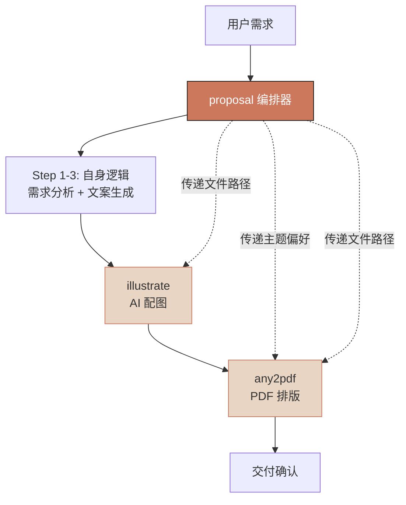
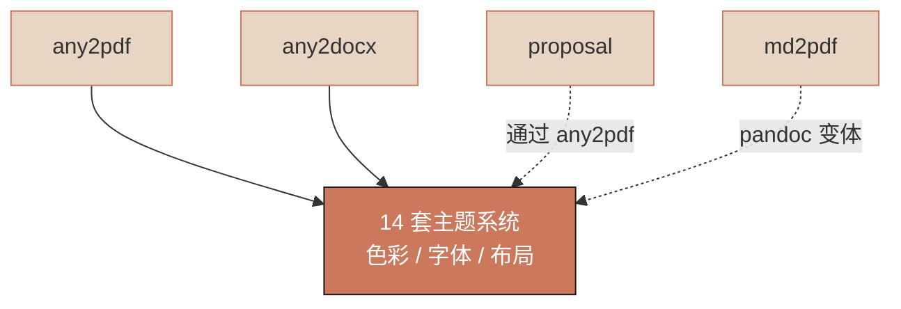
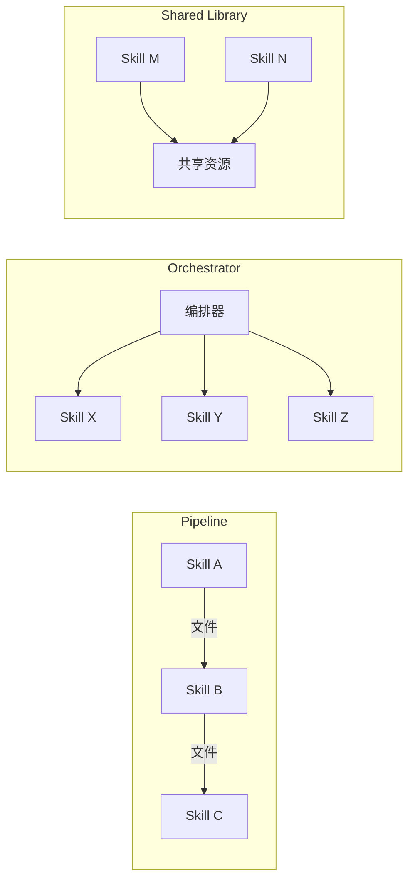
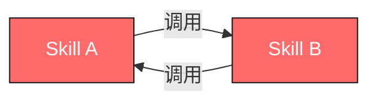
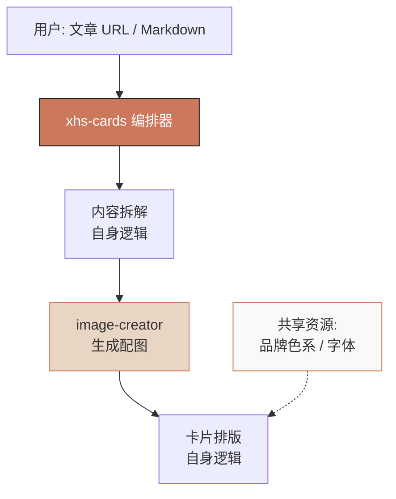

# 第 8 章：Skill 组合模式 — 从单兵到军团

> "Unix 哲学的精髓不是写一个什么都能做的程序，而是写很多小程序，让它们协作。"
> —— Doug McIlroy

单个 Skill 解决单个问题。但真实场景从来不是单个问题 —— 客户说"帮我出份方案"，背后是需求分析、文案生成、配图、排版、导出 PDF 五个环节串联。这一章讲的就是：**如何让多个 Skill 像军团一样协同作战。**

我们将从 lovstudio-skills 仓库的真实案例出发，拆解三种经过验证的组合模式，以及三种你应该避免的反模式。

---

## 8.1 Skill 间调用：基本机制

在 Agent Skill 体系中，一个 Skill 调用另一个 Skill 的方式出奇地简单 —— **直接在 SKILL.md 的 Workflow 中写 slash command。** AI 助手读到指令后，会自动切换到目标 Skill 的上下文执行。

```markdown
### Step 5: 自动生成 PDF

配图完成后，调用 any2pdf skill：

    /lovstudio-any2pdf {illustrated_file_path}

默认推荐选项：
- 主题：chinese-red（政企客户）或 warm-academic（科技客户）
```

这段来自 `lovstudio:proposal` 的 SKILL.md。它没有 import 语句，没有 API 调用，没有 RPC —— 就是一行 slash command。AI 助手看到 `/lovstudio-any2pdf`，就知道要激活 `any2pdf` Skill 并传入文件路径。

这种调用机制有三个特点：

1. **声明式**：你告诉 AI "调用那个 Skill"，而不是写代码去调用
2. **松耦合**：调用方不需要知道被调用方的内部实现
3. **上下文传递**：文件路径、用户偏好等信息通过自然语言传递，不需要序列化/反序列化

### 依赖声明

虽然调用本身是隐式的（写在 Workflow 里），但好的 Skill 会在 frontmatter 中显式声明依赖。看 `lovstudio:proposal` 的做法：

```yaml
compatibility: >
  Pure instruction skill — no scripts. Depends on lovstudio:illustrate
  and lovstudio:any2pdf for the full pipeline.
```

再看 `lovstudio:xbti-creator`：

```yaml
compatibility: >
  Requires Node.js 18+ and a package manager (pnpm/npm/bun).
  Avatar generation requires lovstudio:image-creator skill and ZENMUX_API_KEY.
```

两者都在 `compatibility` 字段中明确列出了依赖的 Skill 和外部工具。这不是运行时强制的 —— 没有包管理器会替你检查 —— 但它是给人（和 AI）看的契约。

### 依赖链管理

当 A 依赖 B，B 又依赖 C 时，依赖链就形成了。以 `proposal` 为例：

```
proposal → illustrate → image-creator (需要 ZENMUX_API_KEY)
proposal → any2pdf (需要 reportlab)
```

当前 Agent Skill 生态没有自动的依赖解析机制（不像 npm 或 pip）。每个 Skill 需要自己在 Workflow 中检查前置条件。`xbti-creator` 的做法值得借鉴 —— 它在 Step 2 里用 bash 逐项检查环境：

```bash
# image-creator skill
ls ~/.claude/skills/lovstudio-image-creator/gen_image.py 2>/dev/null \
  && echo "OK" || echo "MISSING"

# Zenmux API key
[ -n "$ZENMUX_API_KEY" ] && echo "OK" || echo "MISSING"
```

**缺失时自动修复，修不了再问用户。** 这是目前最务实的依赖管理策略。

---

## 8.2 组合模式一：Pipeline（串联）

Pipeline 是最直觉的组合模式 —— 上一步的输出就是下一步的输入，像流水线。

### 模式图


### 真实案例：any2pdf → pdf2png

用户需要把 Markdown 报告发到微信群里 —— 微信不支持 PDF 预览，只能发图片。于是：

1. `any2pdf` 把 Markdown 转为带主题样式的 PDF
2. `pdf2png` 把 PDF 的每一页渲染成高清图片，然后纵向拼接成一张长图

两个 Skill 完全独立开发，各自有自己的 SKILL.md 和脚本。它们之间的"接口"就是一个 PDF 文件。

### Pipeline 模式的设计原则

**原则一：中间产物用通用格式。**

PDF、Markdown、PNG、JSON —— 这些是 Skill 之间最好的"接口"。不要发明自定义的中间格式，那会让 Pipeline 变脆弱。`any2pdf` 输出标准 PDF，任何能处理 PDF 的 Skill 都能接在后面。

**原则二：每个 Skill 必须能独立运行。**

`pdf2png` 不关心 PDF 是 `any2pdf` 生成的还是用户自己的。它只需要一个 PDF 路径。这保证了 Pipeline 中的每个节点都可以单独测试、单独使用。

**原则三：失败时中间产物应该保留。**

如果 `pdf2png` 崩了，用户至少还有 `any2pdf` 生成的 PDF。Pipeline 设计时要确保每一步的输出都写到磁盘，而不是只存在内存里。

### 何时使用 Pipeline

- 数据有明确的"加工方向"：原材料 → 半成品 → 成品
- 每一步的转换逻辑相对独立
- 用户可能只需要中间产物（比如只要 PDF 不要 PNG）

---

## 8.3 组合模式二：Orchestrator（编排）

Orchestrator 比 Pipeline 复杂 —— 一个"指挥官" Skill 协调多个"士兵" Skill，控制执行顺序、传递上下文、处理分支逻辑。

### 模式图



### 真实案例：proposal

`lovstudio:proposal` 是一个典型的 Orchestrator。它的 Workflow 有 6 个 Step：

| Step | 执行者 | 做什么 |
|------|--------|--------|
| 1 | proposal 自身 | 读取/收集客户需求 |
| 2 | proposal 自身 | 交互式确认方案参数（报价策略、主题等） |
| 3 | proposal 自身 | 生成 10 章结构的方案 Markdown |
| 4 | illustrate | AI 自动配图（最多 8 张） |
| 5 | any2pdf | 转为带主题样式的 PDF |
| 6 | proposal 自身 | 输出交付清单 |

关键在于 Step 4 和 Step 5 —— proposal 不会自己画图或排版，它把这些工作**委托**给专门的 Skill。但它掌控全局：决定什么时候调用谁、传什么参数、用什么主题。

再看 SKILL.md 中的具体指令：

```markdown
### Step 4: 自动配图

生成 markdown 后，调用 illustrate skill：

    /lovstudio:illustrate {file_path} --auto --max 8
```

```markdown
### Step 5: 自动生成 PDF

配图完成后，调用 any2pdf skill：

    /lovstudio-any2pdf {illustrated_file_path}

默认推荐选项：
- 主题：chinese-red（政企客户）或 warm-academic（科技客户）
- 水印：商业机密
```

Orchestrator 的威力在于：**每个子 Skill 只做一件事，但组合起来能完成复杂的端到端流程。**

### xbti-creator：带自动修复的 Orchestrator

`lovstudio:xbti-creator` 展示了 Orchestrator 的另一个面向 —— **环境编排**。

它在 Step 2 中检查 6 项前置条件（Node.js、包管理器、git、image-creator Skill、API Key、Python 依赖），对每一项都定义了自动修复策略：

```bash
# image-creator missing → 自动安装
npx skills add lovstudio/skills --skill lovstudio:image-creator

# Python deps missing → 自动安装
pip install google-genai Pillow --break-system-packages
```

只有真正无法自动修复的问题（Node.js 缺失、API Key 缺失）才会中断流程问用户。这种**渐进式降级**的依赖处理方式，比粗暴的"缺依赖就报错退出"好得多。

### Orchestrator 模式的设计原则

**原则一：编排器拥有全局上下文。**

proposal 知道用户选了"精简报价"还是"重点客户"，知道目标客户是政企还是科技公司。它把这些上下文翻译成子 Skill 能理解的参数（`--theme chinese-red` vs `warm-academic`）。子 Skill 不需要知道"为什么用这个主题"。

**原则二：编排器不复制子 Skill 的逻辑。**

proposal 不会自己写 PDF 渲染代码。它信任 `any2pdf` 能把 Markdown 变成好看的 PDF。如果发现自己在编排器里重写子 Skill 的逻辑，说明拆分有问题。

**原则三：编排器定义"胶水"。**

子 Skill 之间不直接通信。所有协调工作 —— 参数映射、文件路径传递、执行顺序控制 —— 都在编排器的 SKILL.md 里完成。这让每个子 Skill 保持独立可测试。

### Pipeline vs Orchestrator：区别在哪？

| 维度 | Pipeline | Orchestrator |
|------|----------|--------------|
| 控制流 | 线性，A→B→C | 有分支、条件、并行可能 |
| 上下文 | 只通过中间产物传递 | 编排器持有全局上下文 |
| 调用方式 | 可以手动串联 | 必须有一个"指挥官" |
| 子 Skill 关系 | 平等，首尾相接 | 主从，编排器统领 |
| 典型场景 | 格式转换链 | 端到端业务流程 |

---

## 8.4 组合模式三：Shared Library（共享资源）

前两种模式是关于"Skill 怎么调用 Skill"。第三种模式不同 —— 它是关于"多个 Skill 怎么共享同一套资源"。

### 模式图



### 真实案例：14 套主题系统

lovstudio-skills 仓库中有 14 套颜色主题（warm-academic、nord-frost、github-light、chinese-red 等）。这套主题被多个 Skill 使用：

- `any2pdf` 用它渲染 PDF 的背景色、文字色、强调色
- `any2docx` 用它设置 Word 文档的样式
- `proposal` 通过调用 `any2pdf` 间接使用它
- `md2pdf` 的 pandoc 引擎有对应的主题变体

看两个 Skill 中主题定义的代码：

**any2pdf/scripts/md2pdf.py：**
```python
# THEMES — each theme has colors + layout for real typographic difference
THEMES = {
    "warm-academic": { ... },
    "nord-frost": { ... },
    "chinese-red": { ... },
    # ... 共 14 套
}
```

**any2docx/scripts/md2docx.py：**
```python
# THEMES — same palette as any2pdf
THEMES = {
    "warm-academic": { ... },
    "nord-frost": { ... },
    "chinese-red": { ... },
    # ... 共 14 套
}
```

注意第二段代码的注释：`same palette as any2pdf`。这说明开发者**有意**让两个 Skill 的主题保持一致。用户在 `any2pdf` 中选了 `warm-academic`，生成的 PDF 和用 `any2docx` 生成的 Word 应该是同一个视觉风格。

### 共享的三种实现方式

在当前 Agent Skill 生态中，共享资源有三种落地方式，各有取舍：

#### 方式一：Copy-Paste（当前做法）

每个 Skill 的脚本里都有一份完整的 `THEMES` 字典。新增主题时需要同步更新所有 Skill。

- **优点**：每个 Skill 完全自包含，零外部依赖
- **缺点**：主题数据重复，新增/修改主题需要多处同步
- **适用**：Skill 数量少（< 5 个），主题变更不频繁

#### 方式二：共享引用文件

把主题定义提取到一个共享位置（比如 `shared/themes.json`），各 Skill 在运行时读取：

```python
import json
from pathlib import Path

THEMES_PATH = Path(__file__).parent.parent.parent.parent / "shared" / "themes.json"
THEMES = json.loads(THEMES_PATH.read_text())
```

- **优点**：Single Source of Truth，改一处全局生效
- **缺点**：引入了路径依赖，单独安装某个 Skill 时可能找不到共享文件
- **适用**：Skill 在同一个仓库中开发和部署

#### 方式三：构建时注入

用构建脚本在发布前把共享数据"烧"进每个 Skill 的脚本里。开发时维护一份，发布时每个 Skill 都是自包含的。

```bash
# build.sh
python scripts/inject_themes.py \
    --source shared/themes.json \
    --targets skills/lovstudio-any2pdf/scripts/md2pdf.py \
              skills/lovstudio-any2docx/scripts/md2docx.py
```

- **优点**：兼顾 DRY 和自包含
- **缺点**：需要额外的构建步骤
- **适用**：Skill 需要独立分发，但数据必须一致

### Shared Library 模式的设计原则

**原则一：共享的是数据，不是逻辑。**

主题的颜色值可以共享，但 `any2pdf` 用 reportlab 渲染和 `any2docx` 用 python-docx 渲染的**逻辑**不应该共享。不同输出格式的渲染逻辑差异很大，强行共享只会制造 leaky abstraction。

**原则二：共享资源必须有版本。**

当你修改了主题色值，需要知道哪些 Skill 还在用旧版本。最简单的做法是在主题数据里加 `version` 字段，或者利用 git 的 blame 追踪同步状态。

**原则三：宁可多复制，不要错共享。**

如果两个 Skill 对同一份数据有不同的需求（比如 `any2pdf` 的主题需要 `code_bg` 字段而 `any2docx` 不需要），不要为了 DRY 而强行统一数据结构。让各自持有各自需要的子集，用注释标明"与 XXX 保持同步"即可。

---

## 8.5 组合模式对比

三种模式并不互斥，一个复杂系统中往往同时存在。下面这张表帮你在具体场景中选择：



| 维度 | Pipeline | Orchestrator | Shared Library |
|------|----------|--------------|----------------|
| 关系 | 串联 | 主从 | 对等 |
| 耦合点 | 中间产物格式 | 编排器的 Workflow | 共享数据的 schema |
| 新增 Skill | 在链上插入新节点 | 编排器增加一个 Step | 新 Skill 引用共享资源 |
| 典型场景 | 格式转换 | 端到端业务流程 | 设计系统 / 配置 |
| 复杂度 | 低 | 中-高 | 低 |

---

## 8.6 反模式：组合中的常见陷阱

### 反模式一：循环依赖



**症状：** Skill A 在某个 Step 调用 Skill B，而 Skill B 在某个 Step 又调用 Skill A。

**后果：** AI 助手陷入死循环，或者在某次调用时上下文窗口溢出。

**修复：** 提取共同逻辑为第三个 Skill，让 A 和 B 都依赖 C 而不是互相依赖。或者重新审视设计 —— 循环依赖几乎总是意味着职责划分有问题。

### 反模式二：隐式依赖

**症状：** Skill A 的 Workflow 里直接写了 `python ~/.claude/skills/lovstudio-foo/scripts/bar.py`，但 `compatibility` 字段里没提 `lovstudio:foo`。

**后果：** 用户单独安装 Skill A，运行时报 "file not found"。排查半天才发现还需要安装另一个 Skill。

**修复：** 所有 Skill 间依赖必须在 `compatibility` 字段中声明。Workflow 中使用 slash command（`/lovstudio:foo`）而不是直接调用脚本路径 —— 这样 AI 助手会提示用户安装缺失的 Skill。

### 反模式三：版本不一致

**症状：** `any2pdf` 新增了第 15 套主题 `sakura-pink`，但忘了同步到 `any2docx`。用户在 `proposal` 中选了 `sakura-pink`，PDF 有对应样式，但导出 Word 时回退到默认主题。

**后果：** 用户感到困惑 —— 同一个主题在不同格式下长得不一样。

**修复三板斧：**

1. **注释锚点**：在每个 THEMES 字典上方写 `# THEMES — same palette as any2pdf, keep in sync`
2. **Changelog 联动**：每次修改主题时，在 commit message 中标注 `[sync: any2pdf, any2docx, md2pdf]`
3. **Lint 检查**（如果你有 CI）：写一个脚本对比各 Skill 的主题列表，不一致时报 warning

### 反模式四：编排器做太多

**症状：** Orchestrator Skill 的 SKILL.md 超过 500 行，其中大部分是应该属于子 Skill 的实现细节。

**后果：** 编排器变成了 monolith。修改任何一个环节都要改编排器。子 Skill 名存实亡，因为所有细节都写在编排器里。

**修复：** 编排器只做三件事 —— (1) 收集用户输入，(2) 决定调用哪些 Skill 以及顺序，(3) 传递参数。其他所有事情都交给子 Skill。如果你发现编排器在写"如何渲染 PDF"的细节，那就是越界了。

---

## 8.7 实战：设计一个新的组合 Skill

让我们用一个假想需求来练习组合模式的应用。

**需求：** 用户说"帮我把这篇文章做成小红书卡片"。

**分析：**

1. 文章需要拆分为多张卡片的文案 —— 这是**内容处理**
2. 每张卡片需要配图 —— 这是**图片生成**
3. 卡片需要加上品牌水印和排版 —— 这是**视觉处理**

**组合设计：**



这里同时用到了三种模式：
- **Orchestrator**：`xhs-cards` 编排整个流程
- **Pipeline**：内容拆解 → 配图 → 排版的线性流
- **Shared Library**：品牌设计资源被卡片排版和配图共同使用

---

## 8.8 本章小结

| 要点 | 内容 |
|------|------|
| 调用机制 | Slash command + 自然语言传参，声明式、松耦合 |
| 依赖声明 | 在 `compatibility` 字段中显式列出，Workflow 中自动检查 |
| Pipeline | 线性串联，中间产物用通用格式，每个节点独立可运行 |
| Orchestrator | 一个编排器统领多个子 Skill，持有全局上下文 |
| Shared Library | 多个 Skill 共享数据资源，注意同步一致性 |
| 核心反模式 | 循环依赖、隐式依赖、版本不一致、编排器过度膨胀 |

**下一步行动：** 审视你已有的 Skill，哪些可以组合？哪些在重复造轮子？如果你发现两个 Skill 的 SKILL.md 里有相似的 Step，也许是时候提取一个共享的子 Skill 了。

> 好的军团不是人多，而是分工明确、配合默契。Skill 组合也一样 —— 每个 Skill 做好自己的事，编排器做好调度，共享资源做好同步。三条线拉齐，复杂的业务流程就能用简单的方式搞定。
