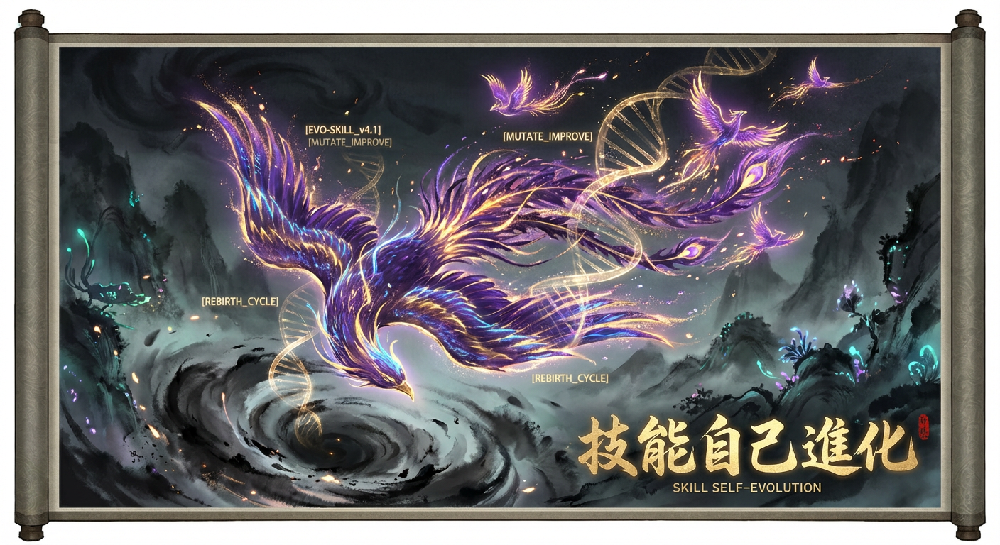

# 第 12 章：Skill 自我进化 — 让 Skill 自己变得更好




> "The best programs are the ones that write themselves."
> — 改编自 Donald Knuth

你写了一个 Skill，它工作得不错。用户反馈说某些 edge case 处理不好，你打开 SKILL.md，调整几行 instruction，测试，发布。下个月又来了新的问题，再改。这个循环你已经重复了几十次。

问题来了：**你能不能让 Skill 自己完成这个循环？**

这不是科幻。2025 年以来，从 Google DeepMind 的 OPRO 到 DSPy 的 MIPRO，从 PromptBreeder 到 TextGrad，一系列研究证明了一件事 —— LLM 不仅能执行指令，还能**优化指令本身**。将这些技术应用到 Skill 领域，就是本章要讲的：**Skill 自我进化**。

---

## 12.1 为什么需要自我进化

### 人工迭代的三个瓶颈

1. **反馈延迟**：用户遇到问题 → 提 issue → 作者排查 → 修改发布，链路太长。一个 edge case 可能要几天才能修复。
2. **认知盲区**：Skill 作者不可能预见所有使用场景。你为 Python 项目设计的 skill，用户拿去处理 Rust monorepo，指令就不够用了。
3. **规模瓶颈**：一个人维护 5 个 Skill 没问题，维护 50 个就力不从心。每个 Skill 都有自己的 failure mode，人工逐一调优不现实。

### 自动化进化的核心思路

把 Skill 的 SKILL.md 视为一段"可优化的程序"。它的输入是用户请求，输出是 agent 行为，评价标准是执行成功率和用户满意度。既然有输入、输出、评价函数，就能跑优化循环：

```
while not good_enough:
    执行 Skill → 收集反馈 → 分析失败原因 → 生成改进方案 → 验证 → 更新 SKILL.md
```

这和传统软件工程的 CI/CD 管线如出一辙，只不过被优化的对象从代码变成了自然语言指令。

---

## 12.2 进化方法论谱系

2023-2026 年间，prompt 优化领域涌现了一系列方法。下面按时间线梳理，帮你建立完整的知识地图。

### 12.2.1 OPRO — LLM-as-Optimizer

**论文**：*Large Language Models as Optimizers*（Google DeepMind, 2023）

核心思路极其简洁：把优化问题本身描述成一段 prompt，让 LLM 生成候选解，用 scoring function 评分，把结果反馈给 LLM 生成更好的解。

应用到 Skill 场景：

```
meta-prompt = """
以下是一个 SKILL.md 的历史版本和对应的成功率：
v1 (成功率 72%)：...
v2 (成功率 78%)：...
v3 (成功率 75%)：...

请生成一个成功率更高的新版本。
"""
```

**优点**：实现简单，只需要一个 LLM 和一个评分函数。
**局限**：搜索效率低，容易在局部最优打转。没有结构化的变异策略。

### 12.2.2 EvoPrompt — 进化算法驱动

**论文**：*Connecting Large Language Models with Evolutionary Algorithms*（2024）

把进化算法（GA/DE）的思路搬过来：维护一个 prompt 种群，用交叉（crossover）和变异（mutation）生成后代，用 fitness function 选择存活者。

```
种群 = [skill_v1, skill_v2, ..., skill_n]
for generation in range(max_gen):
    parents = tournament_select(种群)
    offspring = crossover(parents[0], parents[1])  # LLM 融合两个版本
    mutant = mutate(offspring)                      # LLM 随机修改一个段落
    score = evaluate(mutant)
    种群 = survive(种群 + [mutant], topk)
```

**优点**：比 OPRO 更系统，种群多样性防止早熟收敛。
**局限**：需要大量评估（每代 N 个候选 x M 个测试用例），token 消耗高。

### 12.2.3 PromptBreeder — 自引用进化

**论文**：*PromptBreeder: Self-Referential Self-Improvement*（Google DeepMind, 2024）

最有趣的一个。不仅进化 prompt 本身，还进化"用来进化 prompt 的 meta-prompt"。两层进化嵌套：

- **Task Prompt**：执行任务的指令（对应 SKILL.md）
- **Mutation Prompt**：描述如何修改 Task Prompt 的指令

每一代，Mutation Prompt 指导 Task Prompt 变异；同时 Mutation Prompt 自身也在进化。这就像"进化的进化"—— 不仅改良基因，还改良育种策略。

**优点**：理论上能跳出固定变异策略的限制。
**局限**：实现复杂，调试困难，收敛不稳定。

### 12.2.4 DSPy MIPRO — 编程化优化

**框架**：DSPy（Stanford NLP, 2024-2025）

DSPy 的革命性在于把 prompt engineering 变成了编程问题。你不写 prompt，你写程序：定义 Signature（输入输出规范）、Module（处理步骤）、Metric（评价函数），然后让 optimizer 自动搜索最优 prompt。

MIPRO（Multi-prompt Instruction PRoposal Optimizer）是其中最强的 optimizer：

1. 用 LLM 从训练数据中提取 instructions
2. 用 Bayesian 搜索选择最优组合
3. 自动挑选 few-shot 示例

```python
import dspy

class SkillExecutor(dspy.Module):
    def __init__(self):
        self.plan = dspy.ChainOfThought("user_request -> execution_plan")
        self.execute = dspy.ChainOfThought("execution_plan -> result")

    def forward(self, user_request):
        plan = self.plan(user_request=user_request)
        return self.execute(execution_plan=plan.execution_plan)

# 定义 metric
def skill_metric(example, pred, trace=None):
    return int(pred.result == example.expected_result)

# 自动优化
optimizer = dspy.MIPROv2(metric=skill_metric, num_threads=4)
optimized_skill = optimizer.compile(SkillExecutor(), trainset=train_data)
```

**优点**：工程化程度最高，可复现，可组合。
**局限**：需要标注数据（trainset），对纯指令型 Skill 适配成本较高。

### 12.2.5 TextGrad — 文本反向传播

**论文**：*TextGrad: Automatic "Differentiation" via Text*（Stanford, 2024）

把深度学习的反向传播思路移植到文本域：

- **前向传播**：执行 Skill，产生结果
- **Loss 计算**：评估结果与期望的差距（用自然语言描述）
- **反向传播**：LLM 根据 loss 描述，生成"梯度"（自然语言形式的改进建议）
- **参数更新**：用梯度修改 SKILL.md

```
loss = "用户请求生成 PDF，但中文字符显示为方块。原因是 SKILL.md 中没有指定 CJK 字体回退策略。"
gradient = LLM("根据以下错误，建议如何修改 SKILL.md：" + loss)
# gradient = "在 SKILL.md 的字体配置段落加入：当检测到 CJK 字符时，优先使用 Noto Sans CJK..."
new_skill = LLM("将以下修改建议应用到 SKILL.md：" + gradient + "
原文：" + old_skill)
```

**优点**：反馈直接、修改精准，特别适合修复特定 bug。
**局限**：每次只能沿一个"梯度方向"优化，全局搜索能力弱。

### 方法对比

| 方法 | 核心思想 | 搜索策略 | Token 成本 | 适合场景 | 工程复杂度 |
|------|---------|---------|-----------|---------|-----------|
| OPRO | LLM 直接生成更优版本 | 历史引导 | 低 | 快速原型 | 低 |
| EvoPrompt | 进化算法 + LLM | 种群进化 | 高 | 大规模搜索 | 中 |
| PromptBreeder | 自引用双层进化 | 元进化 | 很高 | 研究探索 | 高 |
| DSPy MIPRO | 编程化 + Bayesian | 贝叶斯优化 | 中 | 有标注数据时 | 中 |
| TextGrad | 文本反向传播 | 梯度下降 | 低 | 修复特定问题 | 低 |
| Experience-Based | 日志驱动修订 | 人工/LLM 混合 | 很低 | 日常维护 | 很低 |

> **实践建议**：对于大多数 Skill 开发者，从 Experience-Based（方案 A）开始。当你有了足够的测试数据后，再考虑 DSPy MIPRO（方案 B）。TextGrad（方案 C）适合定点修复。PromptBreeder 目前更适合研究场景。

---

## 12.3 开源进化引擎实战

理论之后，来看真正能跑起来的开源项目。以下四个引擎代表了 2025-2026 年 Skill 进化的工程前沿。

### 12.3.1 EvoMap Evolver — Skill 基因级遗传

**GitHub**: `EvoMap/evolver`

EvoMap 提出了 GEP（Gene Expression Programming）协议，把 Skill 拆解为"基因片段"：

- **Instruction Gene**：核心指令段落
- **Constraint Gene**：约束条件（不要做什么）
- **Example Gene**：Few-shot 示例
- **Tool Gene**：工具调用模式

每个基因可以独立进化、跨 Skill 继承。比如你的 `any2pdf` 有一个优秀的"CJK 字体处理"基因，可以直接移植到 `any2docx`，而不需要从头调优。

**核心流程**：

```
1. 解析 SKILL.md → 基因组（Gene Pool）
2. 对每个基因独立评估 fitness
3. 跨 Skill 基因交换（Gene Transfer）
4. 组装新基因组 → 生成新 SKILL.md
5. 集成测试 → 择优保留
```

**适用场景**：管理大量相关 Skill 的团队。基因复用能显著降低全局调优成本。

### 12.3.2 Hermes Agent Self-Evolution

**GitHub**: `NousResearch/hermes-agent-self-evolution`
**论文**: ICLR 2026 Oral

NousResearch 的这个项目把 DSPy 和进化算法结合，提出了 GEPA（Guided Evolution with Performance Anchoring）引擎：

1. **Performance Anchoring**：为每个 Skill 版本建立性能基线（anchor），任何变异必须超过 anchor 才能存活
2. **Guided Mutation**：不是随机变异，而是用 LLM 分析失败案例后定向变异
3. **Self-Play**：让进化后的 Skill 互相测试，发现对方的弱点

关键创新在于**稳定性**。传统进化方法容易出现"进化退化"—— 新版本在某些 case 上更好，但在老 case 上更差。Performance Anchoring 通过维护一个回归测试集，确保进化只前进不后退。

**实测数据**（论文报告）：
- 在 SWE-bench 上，经过 5 轮自进化的 coding agent，解决率从 38% 提升到 52%
- 平均每轮进化只需 ~200 次 LLM 调用

### 12.3.3 EvoSkill — 从失败中学习

**GitHub**: `sentient-agi/EvoSkill`

EvoSkill 的哲学很实用：**失败是最好的老师**。它不是优化现有 Skill，而是从 agent 的失败轨迹中自动合成新的 Skill。

工作流程：

```
1. 收集 agent 执行日志（成功 + 失败）
2. 聚类失败模式（用 embedding 做相似性分组）
3. 对每个失败簇，用 LLM 分析根因
4. 合成新 Skill（或 Skill 片段）来解决该类失败
5. 验证新 Skill 确实能覆盖该失败模式
6. 注册到 Skill Library，供 agent 在后续任务中调用
```

**杀手特性**：它产生的不是"更好的指令"，而是**全新的能力模块**。比如 agent 在处理 YAML 配置时反复失败，EvoSkill 会自动合成一个 `yaml-validator` Skill，包含 schema 校验、常见错误修复等逻辑。

**适用场景**：需要持续扩展 agent 能力边界的场景。特别适合搭配 Skill marketplace 使用。

### 12.3.4 OpenSpace — 跨行业 Skill 进化

**GitHub**: `HKUDS/OpenSpace`

OpenSpace 关注的是**跨领域迁移**。它的核心假设是：不同行业的 Skill 之间存在可迁移的通用模式。

核心机制：

- **Space Mapping**：将所有 Skill 映射到一个语义空间，相似 Skill 距离近
- **Cross-Pollination**：从高性能行业（如 DevOps）的 Skill 中提取成功模式，迁移到低性能行业（如 Legal）
- **Domain Adaptation**：迁移后做领域适配微调

**论文报告的 4.2x 效能提升**来自一个实验：把 DevOps 领域的"故障排查"Skill 模式迁移到医疗领域的"诊断推理"Skill，后者的准确率从 34% 跳到 71%。模式的本质是相同的 —— 收集症状、排除假设、定位根因 —— 只是领域术语不同。

### 引擎对比

| 引擎 | 核心机制 | 输入 | 输出 | 最佳场景 |
|------|---------|------|------|---------|
| EvoMap Evolver | 基因分解 + 跨 Skill 继承 | 多个 SKILL.md | 优化后的 SKILL.md | 管理 Skill 家族 |
| Hermes Self-Evolution | GEPA + Performance Anchoring | SKILL.md + 测试集 | 稳定进化的版本 | 需要保证不退化 |
| EvoSkill | 失败轨迹 → 新 Skill 合成 | Agent 执行日志 | 全新的 Skill | 扩展能力边界 |
| OpenSpace | 跨行业语义迁移 | 多行业 Skill 库 | 迁移适配后的 Skill | 跨领域复用 |

---

## 12.4 实战：构建 Skill 进化管线

理论和工具都有了，现在来构建你自己的进化管线。给出三个方案，从简单到复杂。

### 方案 A：Experience-Based 进化（最实用）

这是最务实的方案，不需要任何额外框架，只需要 LLM API 和基本的脚本能力。核心思想：**收集执行日志 → 分析失败 → LLM 生成修订建议 → Lint 验证 → 人工审批**。

#### 架构

```
┌──────────┐    ┌──────────┐    ┌──────────┐    ┌──────────┐    ┌──────────┐
│  Agent   │───▸│  日志    │───▸│  分析    │───▸│  修订    │───▸│  验证    │
│  执行    │    │  收集    │    │  引擎    │    │  生成    │    │  & 发布  │
└──────────┘    └──────────┘    └──────────┘    └──────────┘    └──────────┘
     │                                                              │
     └──────────────────── 更新后的 SKILL.md ◂──────────────────────┘
```

#### 完整伪代码

```python
"""
Experience-Based Skill Evolution Pipeline
输入：SKILL.md 路径 + 执行日志目录
输出：改进后的 SKILL.md（写入 _evolved/ 目录待审批）
"""
import json
import hashlib
from pathlib import Path
from datetime import datetime

# ── 配置 ──────────────────────────────────────────────
EVOLUTION_CONFIG = {
    "min_logs_for_evolution": 20,        # 至少 20 条日志才触发进化
    "failure_threshold": 0.15,           # 失败率超过 15% 才值得优化
    "max_instructions_per_round": 3,     # 每轮最多修改 3 条指令
    "require_human_approval": True,      # 是否需要人工审批
}

# ── Step 1: 日志收集 ────────────────────────────────────
def collect_logs(log_dir: Path) -> list[dict]:
    """
    收集 agent 执行日志。每条日志包含：
    - user_request: 用户原始请求
    - skill_version: 使用的 SKILL.md 版本 hash
    - steps: agent 执行的步骤列表
    - outcome: "success" | "failure" | "partial"
    - error_message: 失败时的错误信息（可选）
    - user_feedback: 用户反馈（可选）
    - duration_seconds: 执行耗时
    """
    logs = []
    for f in sorted(log_dir.glob("*.jsonl")):
        for line in f.read_text().splitlines():
            if line.strip():
                logs.append(json.loads(line))
    return logs

# ── Step 2: 失败分析 ────────────────────────────────────
def analyze_failures(logs: list[dict]) -> dict:
    """
    统计失败模式，返回结构化分析报告。
    """
    total = len(logs)
    failures = [l for l in logs if l["outcome"] != "success"]
    failure_rate = len(failures) / total if total > 0 else 0

    if failure_rate < EVOLUTION_CONFIG["failure_threshold"]:
        return {"should_evolve": False, "reason": "failure rate below threshold"}

    # 按错误类型聚类
    error_clusters = {}
    for f in failures:
        key = f.get("error_message", "unknown")[:100]  # 取前 100 字符做粗分组
        if key not in error_clusters:
            error_clusters[key] = []
        error_clusters[key].append(f)

    # 按频率排序，取 top 5
    sorted_clusters = sorted(error_clusters.items(), key=lambda x: -len(x[1]))[:5]

    return {
        "should_evolve": True,
        "total_logs": total,
        "failure_rate": failure_rate,
        "top_failure_patterns": [
            {
                "pattern": pattern,
                "count": len(examples),
                "sample_requests": [e["user_request"] for e in examples[:3]],
            }
            for pattern, examples in sorted_clusters
        ],
    }

# ── Step 3: LLM 修订生成 ───────────────────────────────
def generate_revision(skill_md: str, analysis: dict) -> dict:
    """
    调用 LLM，根据失败分析生成 SKILL.md 修订建议。
    返回：{ "changes": [...], "rationale": str, "risk_assessment": str }
    """
    prompt = f"""你是一位 Skill 优化专家。以下是一个 SKILL.md 的当前版本和执行失败分析报告。

## 当前 SKILL.md
```
{skill_md}
```

## 失败分析报告
{json.dumps(analysis, ensure_ascii=False, indent=2)}

## 任务
1. 分析每个失败模式的根因
2. 提出具体的 SKILL.md 修改建议（最多 {EVOLUTION_CONFIG['max_instructions_per_round']} 条）
3. 对每条修改评估风险（是否可能影响现有成功 case）

以 JSON 格式输出：
{{
  "changes": [
    {{
      "section": "要修改的段落标识",
      "old_text": "原文（用于定位）",
      "new_text": "修改后的文本",
      "addresses_pattern": "解决哪个失败模式",
      "confidence": 0.0-1.0
    }}
  ],
  "rationale": "整体修改思路",
  "risk_assessment": "可能的副作用"
}}"""

    response = call_llm(prompt)  # 你的 LLM API 调用
    return json.loads(response)

# ── Step 4: 应用修订 ────────────────────────────────────
def apply_revision(skill_md: str, revision: dict) -> str:
    """
    将修订建议应用到 SKILL.md，生成新版本。
    只应用 confidence >= 0.7 的修改。
    """
    new_md = skill_md
    applied = []

    for change in revision["changes"]:
        if change["confidence"] < 0.7:
            continue
        if change["old_text"] in new_md:
            new_md = new_md.replace(change["old_text"], change["new_text"], 1)
            applied.append(change["section"])

    # 更新版本号（如果 frontmatter 中有的话）
    # 在 SKILL.md 末尾追加进化记录
    evolution_log = f"""
<!-- Evolution Record
date: {datetime.now().isoformat()}
trigger: failure_rate={revision.get('failure_rate', 'N/A')}
changes_applied: {applied}
rationale: {revision['rationale']}
-->"""
    new_md += evolution_log

    return new_md

# ── Step 5: Lint 验证 ───────────────────────────────────
def validate_evolved_skill(skill_md: str) -> dict:
    """
    对进化后的 SKILL.md 做基本校验：
    - frontmatter 格式正确
    - 必需字段存在（name, description, instructions）
    - 指令不超过 token 上限
    - 没有引入矛盾指令（简单的语义检查）
    """
    errors = []
    warnings = []

    # 检查 frontmatter
    if not skill_md.startswith("---"):
        errors.append("Missing frontmatter")

    # 检查 token 数（粗略估计）
    token_estimate = len(skill_md) // 4
    if token_estimate > 8000:
        warnings.append(f"SKILL.md 约 {token_estimate} tokens，可能超出 context 预算")

    # 检查矛盾指令（简单版：查找 "始终" 和 "不要" 是否作用于同一对象）
    # 生产环境应该用 LLM 做更深层的语义检查
    lines = skill_md.split("
")
    always_do = [l for l in lines if "始终" in l or "always" in l.lower()]
    never_do = [l for l in lines if "不要" in l or "never" in l.lower() or "禁止" in l]
    if always_do and never_do:
        warnings.append("存在 always/never 指令，请人工确认无矛盾")

    return {"valid": len(errors) == 0, "errors": errors, "warnings": warnings}

# ── 主流程 ──────────────────────────────────────────────
def evolve_skill(skill_path: Path, log_dir: Path, output_dir: Path):
    """
    Skill 进化主流程。
    """
    # 读取当前 SKILL.md
    skill_md = skill_path.read_text()
    version_hash = hashlib.sha256(skill_md.encode()).hexdigest()[:8]

    # Step 1: 收集日志
    logs = collect_logs(log_dir)
    if len(logs) < EVOLUTION_CONFIG["min_logs_for_evolution"]:
        print(f"日志不足（{len(logs)}/{EVOLUTION_CONFIG['min_logs_for_evolution']}），跳过进化")
        return

    # Step 2: 分析失败
    analysis = analyze_failures(logs)
    if not analysis["should_evolve"]:
        print(f"失败率未达阈值：{analysis.get('reason')}")
        return

    print(f"检测到 {analysis['failure_rate']:.1%} 失败率，启动进化...")
    print(f"Top 失败模式：")
    for p in analysis["top_failure_patterns"]:
        print(f"  [{p['count']}次] {p['pattern'][:80]}")

    # Step 3: 生成修订
    revision = generate_revision(skill_md, analysis)
    print(f"
修订方案：{revision['rationale']}")
    print(f"风险评估：{revision['risk_assessment']}")

    # Step 4: 应用修订
    evolved_md = apply_revision(skill_md, revision)

    # Step 5: 验证
    validation = validate_evolved_skill(evolved_md)
    if not validation["valid"]:
        print(f"验证失败：{validation['errors']}")
        return

    if validation["warnings"]:
        print(f"警告：{validation['warnings']}")

    # 写入待审批目录
    output_dir.mkdir(parents=True, exist_ok=True)
    output_path = output_dir / f"SKILL_evolved_{version_hash}.md"
    output_path.write_text(evolved_md)

    if EVOLUTION_CONFIG["require_human_approval"]:
        # 生成 diff 供人工审阅
        diff_path = output_dir / f"DIFF_{version_hash}.md"
        diff_content = generate_diff(skill_md, evolved_md)
        diff_path.write_text(diff_content)
        print(f"
进化完成，待审批：{output_path}")
        print(f"变更 diff：{diff_path}")
    else:
        # 直接替换
        skill_path.write_text(evolved_md)
        print(f"
进化完成，已自动应用")

def generate_diff(old: str, new: str) -> str:
    """生成人类可读的 diff 报告"""
    import difflib
    diff = difflib.unified_diff(
        old.splitlines(keepends=True),
        new.splitlines(keepends=True),
        fromfile="SKILL.md (before)",
        tofile="SKILL.md (after)",
    )
    return "".join(diff)
```

#### 日志格式规范

要让进化管线工作，首先需要标准化的执行日志。建议在你的 agent 框架中输出如下格式的 JSONL：

```json
{
  "timestamp": "2026-04-14T10:30:00Z",
  "skill_name": "lovstudio:any2pdf",
  "skill_version": "a3f2b1c8",
  "user_request": "把这篇论文转成 PDF，要用 nord-frost 主题",
  "steps": [
    {"action": "read_file", "target": "paper.md", "status": "ok"},
    {"action": "run_script", "target": "md2pdf.py", "args": "--theme nord-frost", "status": "error", "error": "Font not found: FiraCode"}
  ],
  "outcome": "failure",
  "error_message": "Font not found: FiraCode",
  "duration_seconds": 12.3
}
```

#### 触发策略

不要每次失败就跑进化。推荐的触发策略：

| 触发方式 | 条件 | 适用场景 |
|---------|------|---------|
| 定时批量 | 每周一，若累积日志 >= 20 条 | 稳定运行的 Skill |
| 阈值触发 | 近 50 次执行失败率 > 15% | 需要快速响应的场景 |
| 手动触发 | 开发者主动运行 | 开发调试阶段 |
| CI/CD 集成 | PR 合并后自动评估 | 成熟的 Skill 仓库 |

### 方案 B：DSPy MIPRO 进化

当你有标注数据（输入-期望输出对）时，DSPy 能发挥更大威力。

#### 准备工作

```bash
pip install dspy-ai
```

#### 核心实现

```python
import dspy

# 1. 连接 LLM
lm = dspy.LM("anthropic/claude-sonnet-4-20250514")
dspy.configure(lm=lm)

# 2. 定义 Skill 执行的 Signature
class SkillExecution(dspy.Signature):
    """根据用户请求和 Skill 指令，生成执行计划并执行"""
    user_request: str = dspy.InputField(desc="用户的原始请求")
    skill_context: str = dspy.InputField(desc="SKILL.md 中的关键指令")
    execution_result: str = dspy.OutputField(desc="执行结果")

# 3. 构建模块
class EvolvableSkill(dspy.Module):
    def __init__(self):
        self.executor = dspy.ChainOfThought(SkillExecution)

    def forward(self, user_request, skill_context):
        return self.executor(user_request=user_request, skill_context=skill_context)

# 4. 准备训练数据（从执行日志中提取）
trainset = [
    dspy.Example(
        user_request="把 README.md 转成 PDF",
        skill_context="...",
        execution_result="成功生成 README.pdf，使用 warm-academic 主题"
    ).with_inputs("user_request", "skill_context"),
    # ... 更多样本
]

# 5. 定义 metric
def execution_quality(example, pred, trace=None):
    """评估执行结果质量（0-1）"""
    # 简单版：关键词匹配
    if "成功" in pred.execution_result or "success" in pred.execution_result.lower():
        return 1.0
    return 0.0

# 6. 运行 MIPRO 优化
optimizer = dspy.MIPROv2(
    metric=execution_quality,
    num_candidates=10,      # 生成 10 个候选 prompt
    num_threads=4,
    max_bootstrapped_demos=3,
    max_labeled_demos=5,
)

optimized_skill = optimizer.compile(
    EvolvableSkill(),
    trainset=trainset,
    requires_permission_to_run=True,  # 安全起见，需确认
)

# 7. 提取优化后的 instructions
print(optimized_skill.executor.signature.instructions)
# 将其写回 SKILL.md 的对应段落
```

**关键要点**：

- DSPy 优化的是 prompt 中的 instructions 和 few-shot examples，不是整个 SKILL.md
- 需要将 SKILL.md 中可优化的部分提取为 DSPy Signature 的 instructions
- 优化完成后，把新 instructions 写回 SKILL.md
- MIPRO 的搜索空间指数级增长，`num_candidates` 控制在 10-30 之间即可

### 方案 C：TextGrad 定向修复

TextGrad 特别适合"知道哪里出了问题，但不确定怎么改"的场景。

```python
import textgrad as tg

# 1. 初始化
engine = tg.get_engine("claude-sonnet-4-20250514")
tg.set_backward_engine(engine)

# 2. 将 SKILL.md 的关键段落设为可优化变量
skill_instructions = tg.Variable(
    value="""当用户请求生成 PDF 时：
1. 检测输入文件格式（.md / .txt / .rst）
2. 询问主题偏好
3. 调用 md2pdf.py 执行转换""",
    role_description="Skill 的核心执行指令",
    requires_grad=True,  # 标记为可优化
)

# 3. 定义前向传播（模拟执行）
def simulate_execution(instructions, user_request):
    """模拟 agent 按照指令执行用户请求"""
    response = engine.generate(
        f"你是一个 AI agent，按照以下指令处理用户请求。

指令：{instructions.value}

用户请求：{user_request}"
    )
    return tg.Variable(value=response, role_description="执行结果")

# 4. 定义 loss function
def compute_loss(result, expected):
    """用 LLM 评估结果与期望的差距"""
    loss = engine.generate(
        f"对比以下执行结果和期望结果，描述差距和改进方向。
结果：{result.value}
期望：{expected}"
    )
    return tg.Variable(value=loss, role_description="loss/改进方向")

# 5. 执行优化循环
test_cases = [
    ("把这个 .rst 文件转成 PDF", "应该先将 .rst 转为 .md，再调用 md2pdf.py"),
    ("生成一个带目录的 PDF", "应该在 md2pdf.py 调用中加入 --toc 参数"),
]

optimizer = tg.TGD(parameters=[skill_instructions], lr=1)  # lr 控制更新幅度

for request, expected in test_cases:
    result = simulate_execution(skill_instructions, request)
    loss = compute_loss(result, expected)
    loss.backward()         # 文本反向传播：生成改进建议
    optimizer.step()        # 应用改进到 skill_instructions

print("优化后的指令：")
print(skill_instructions.value)
```

**TextGrad 的优势在于可解释性**。每一步"梯度"都是自然语言形式的改进建议，你能清楚看到为什么做出每个修改。但它也有明显的局限：一次只能沿一个方向优化，容易陷入局部最优。

### 三种方案对比

| 维度 | 方案 A: Experience-Based | 方案 B: DSPy MIPRO | 方案 C: TextGrad |
|------|------------------------|-------------------|-----------------|
| 前置要求 | 执行日志 | 标注数据集 | 失败 case + 期望结果 |
| 实现复杂度 | 一个 Python 脚本 | 需要 DSPy 框架 | 需要 TextGrad 库 |
| 搜索能力 | 依赖 LLM 的单次推理 | 贝叶斯全局搜索 | 局部梯度下降 |
| 优化粒度 | 整个 SKILL.md | Signature 中的 instructions | 指定段落 |
| 人工参与 | 高（需审批） | 低（自动选优） | 中（需定义 test case） |
| Token 消耗 | ~5K/轮 | ~50K-200K/轮 | ~10K/轮 |
| 推荐用法 | 日常迭代 | 大版本优化 | 定点修复 |

---

## 12.5 案例：设计 lovstudio:skill-evolver 元技能

最后，把上面的理论落地成一个真正的 Skill —— `lovstudio:skill-evolver`。这是一个**元技能（Meta-Skill）**：它的作用是优化其他 Skill。

### 设计目标

```
输入：一个 Skill 的路径 + 执行日志
输出：改进后的 SKILL.md + 变更报告
约束：每次最多修改 3 个段落；必须通过 lint；需人工确认
```

### SKILL.md 骨架

```yaml
---
name: skill-evolver
description: 分析 Skill 执行日志，自动生成 SKILL.md 改进方案
version: 0.1.0
author: lovstudio
tags: [meta, evolution, optimization]
compatibility:
  - claude-code
---
```

### 核心 Workflow

```
Step 1: 环境检查
  - 确认目标 Skill 路径存在
  - 确认日志目录存在且有足够数据
  - 读取当前 SKILL.md，计算版本 hash

Step 2: 日志分析
  - 解析 JSONL 日志
  - 统计成功率、平均耗时、失败模式分布
  - 如果失败率 < 15%，报告"无需进化"并退出

Step 3: 根因分析
  - 对 top-5 失败模式逐个分析
  - 定位到 SKILL.md 中导致失败的具体指令段落
  - 区分：指令缺失 vs 指令模糊 vs 指令错误

Step 4: 生成修订
  - 对每个问题生成修复建议（附 confidence 分数）
  - 只保留 confidence >= 0.7 的修改
  - 检查修改间是否互相冲突

Step 5: 验证 & 输出
  - 对修订后的 SKILL.md 运行 lint（调用 lovstudio:skill-optimizer）
  - 生成 unified diff
  - 生成变更报告（Markdown 格式）
  - 询问用户是否应用修改
```

### 与 CI/CD 集成

在成熟的 Skill 仓库中，可以把 `skill-evolver` 集成到 GitHub Actions：

```yaml
# .github/workflows/skill-evolution.yml
name: Skill Evolution Check
on:
  schedule:
    - cron: '0 9 * * 1'  # 每周一早 9 点
  workflow_dispatch:       # 手动触发

jobs:
  evolve:
    runs-on: ubuntu-latest
    steps:
      - uses: actions/checkout@v4
      - name: Download execution logs
        run: |
          # 从你的日志存储拉取最近一周的执行日志
          aws s3 sync s3://skill-logs/last-week ./logs/
      - name: Run evolution analysis
        run: |
          for skill_dir in skills/lovstudio-*/; do
            python scripts/evolve.py \
              --skill "$skill_dir/SKILL.md" \
              --logs "./logs/$(basename $skill_dir)/" \
              --output "./evolution-reports/"
          done
      - name: Create PR if changes found
        run: |
          if [ -n "$(ls evolution-reports/*.md 2>/dev/null)" ]; then
            git checkout -b evolution/$(date +%Y-%m-%d)
            # 应用所有通过验证的修改
            python scripts/apply_evolution.py --reports ./evolution-reports/
            git add skills/
            git commit -m "chore(evolution): auto-evolve skills based on weekly logs"
            gh pr create \
              --title "Skill Evolution: $(date +%Y-%m-%d)" \
              --body "$(cat evolution-reports/SUMMARY.md)"
          fi
```

这样，每周一你会收到一个 PR，里面是所有 Skill 的改进建议，附带详细的失败分析和 diff。你只需要 review 和 merge。

---

## 本章小结

| 要点 | 说明 |
|------|------|
| Skill 进化的本质 | 把 SKILL.md 视为可优化的程序，用执行反馈驱动迭代 |
| 方法论谱系 | OPRO → EvoPrompt → PromptBreeder → DSPy MIPRO → TextGrad |
| 最实用的方案 | Experience-Based（方案 A），日志驱动 + LLM 修订 + Lint 验证 |
| 最强的方案 | DSPy MIPRO（方案 B），但需要标注数据 |
| 最精准的方案 | TextGrad（方案 C），适合定点修复 |
| 元技能设计 | `skill-evolver` 可以集成到 CI/CD，实现"每周自动进化" |
| 安全底线 | 始终保留人工审批环节；维护回归测试集防止退化 |

Skill 自我进化是 2025-2026 年最值得关注的技术方向之一。它不会取代人类 Skill 设计者 —— 恰恰相反，它把设计者从繁琐的日志分析和参数调优中解放出来，让你专注于更高层次的设计决策：**这个 Skill 应该解决什么问题？它的边界在哪里？它和其他 Skill 如何组合？**

进化引擎负责"怎么做得更好"，你负责"做什么"和"为什么做"。这才是人机协作的正确分工。

> **下一章预告**：第 13 章将讨论 Skill 的发布、分发与安全 —— 当你的 Skill 足够好，如何让更多人安全地使用它。
